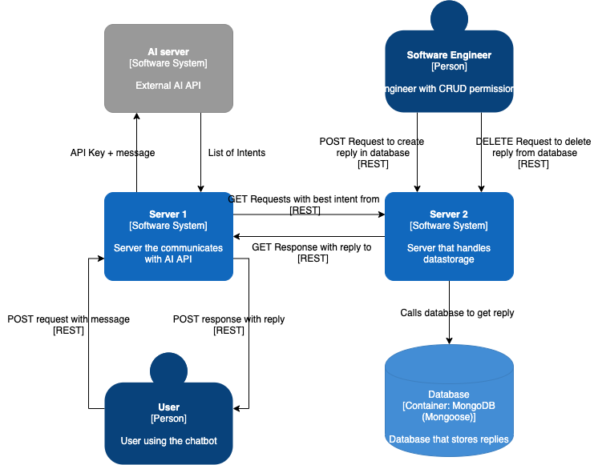

# Chatbot Challenge
2 servers chatbot challenge





## TODO:
- [x] set up dev env
- [x] connect s2 with db
- [x] make s1 call ai api and get intents
- [x] make server 1 call server2 and find reply by intent
- [ ]  make server 1 call server2 and find reply by intent and botId
	- [ ] make multiple responses for each botId (company in my db)
- [x] implement function to seed s2 replies db, run from script
- [x] standardize endpoint nouns
- [ ] further separate services out from controllers
- [x] implement jsonschema and/or ajv
- [x] implement create route for s2
- [x]  implement delete route for s2
- [ ]  do jsdocs
- [ ] implement token middleware to protect crud routes for s2
- [ ] implement tests
- [ ] add swagger docs
- - - -
Hello! We’re excited that you want to join the team.
If you have any questions regarding this task, please don’t hesitate to ask us.
Please do not spend more than a few hours on this challenge. We do not expect a solution that is production ready.

## Some Background Information

Most of our clients use our AI as a customer service bot in chats on their websites.
When one of their users writes a message in the chat, our AI analyzes that message to understand the users intent and gives the appropriate reply, for example:

- - - -
> User: “Hello”

**AI understands that this is a Greeting**

> AI: “Hello :) How can I help you?”
- - - -

From the perspective of the service that consumes the AI API, a message is given to the AI and a list of intents is returned. A simplified version looks something like this:

- - - -
```
[{
	name: “Greeting”,
	confidence: 0.81
}, {
	name: “Delivery status”,
	confidence: 0.18
}, {
	name: “Refund possibility”,
	confidence: 0.01
}]
```
- - - -

The AI does not give one definitive intent, but a list of intents with confidences.The confidence means how sure the AI was that this is the correct answer.Usually the reply that is related to this intent is only given if the confidence is above acertain threshold specified by us. In other cases we give the visitor a default answer that can for example tell the visitor that the AI could not give the correct answer.

## Your Challenge

Your task is to create a backend infrastructure that accepts visitor written messages through an API and returns a virtual assistant reply. Attached you will find a swagger file to a public API on our system, that you can use to get AI predicted intents.

## Minimum requirements
- [ ] Create two different HTTP servers written in NodeJS.
- [ ] The first server should use the public API provided by us, and then pass the intent to the second server.- The apiKey is xxx-xxx-xxx-xxx
- [ ] The second server should use a mongo database, where it reads the reply from with the intent and returns it to the first server. The schema of the reply is left to you, and you should use an ODM such as mongoose to design it.
- [ ] The second server should also have an API for the creation and deletion of the said replies.
- [ ] Tests written in a framework like Mocha that verifies basic functionality.

## Extra points -
Do these if you feel comfortable with TypeScript or have spare time after the other things are done. These are not needed to complete the challenge successfully and a well made solution in JS is preferred over an average one in TS
- [ ] Use TypeScript
- [ ] Swagger files for your APIs

## What we look for:
- [ ] Clean code that is easy to read and written with reusability and testability in mind.
- [ ] Some comments or documentation to help us understand the choices you made.
